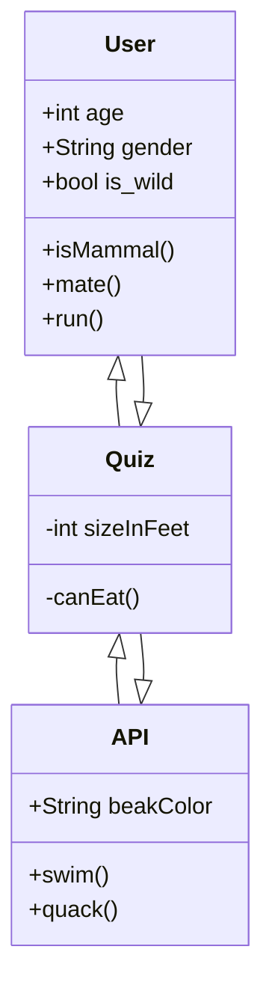

```mermaid
  classDiagram
    User <|-- Quiz
    Quiz <|-- User
    Quiz <|-- API
    API <|-- Quiz
    User : +int age
    User : +String gender
    User: +isMammal()
    User: +mate()
    class API{
        +String beakColor
        +swim()
        +quack()
    }
    class Quiz{
        -int sizeInFeet
        -canEat()
    }
    class User{
        +bool is_wild
        +run()
    }


```
