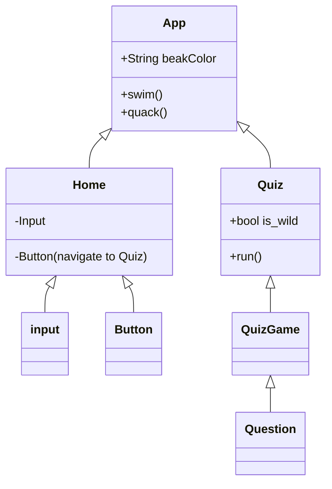

```mermaid
  classDiagram
    App <|-- Home
    App <|-- Quiz
    Home <|-- input
    Home <|-- Button
    Quiz <|-- QuizGame
    QuizGame <|-- Question

    class App {
        +String beakColor
        +swim()
        +quack()
    }

    class Home {
        -Input
        -Button(navigate to Quiz)
    }

    class Quiz {
        +bool is_wild
        +run()
    }

    class QuizGame {

    }

    class Question {

    }


```
