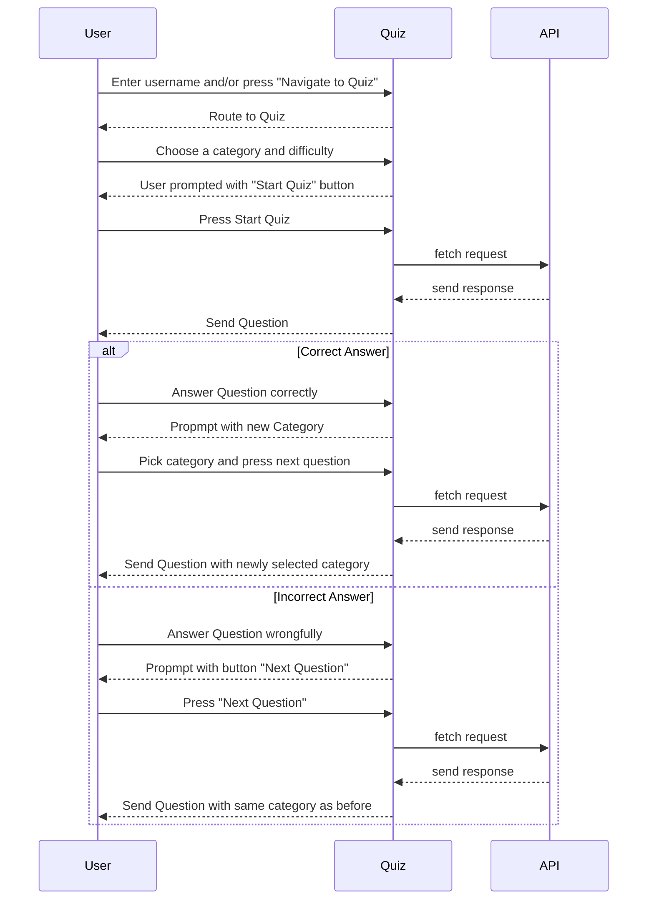

```mermaid
  sequenceDiagram
      participant User
      participant Quiz
      participant API

      User->>Quiz: Enter username and/or press "Navigate to Quiz"
      Quiz-->>User: Route to Quiz
      User->>Quiz: Choose a category and difficulty
      Quiz-->>User: User prompted with "Start Quiz" button
      User->>Quiz: Press Start Quiz
      Quiz->>API: fetch request
      API-->>Quiz: send response
      Quiz-->>User: Send Question

    alt Correct Answer
      User->>Quiz: Answer Question correctly
      Quiz-->>User: Propmpt with new Category
      User->>Quiz: Pick category and press next question
      Quiz->>API: fetch request
      API-->>Quiz: send response
      Quiz-->>User: Send Question with newly selected category

    else Incorrect Answer
      User->>Quiz: Answer Question wrongfully
      Quiz-->>User: Propmpt with button "Next Question"
      User->>Quiz: Press "Next Question"
      Quiz->>API: fetch request
      API-->>Quiz: send response
      Quiz-->>User: Send Question with same category as before
end
```
